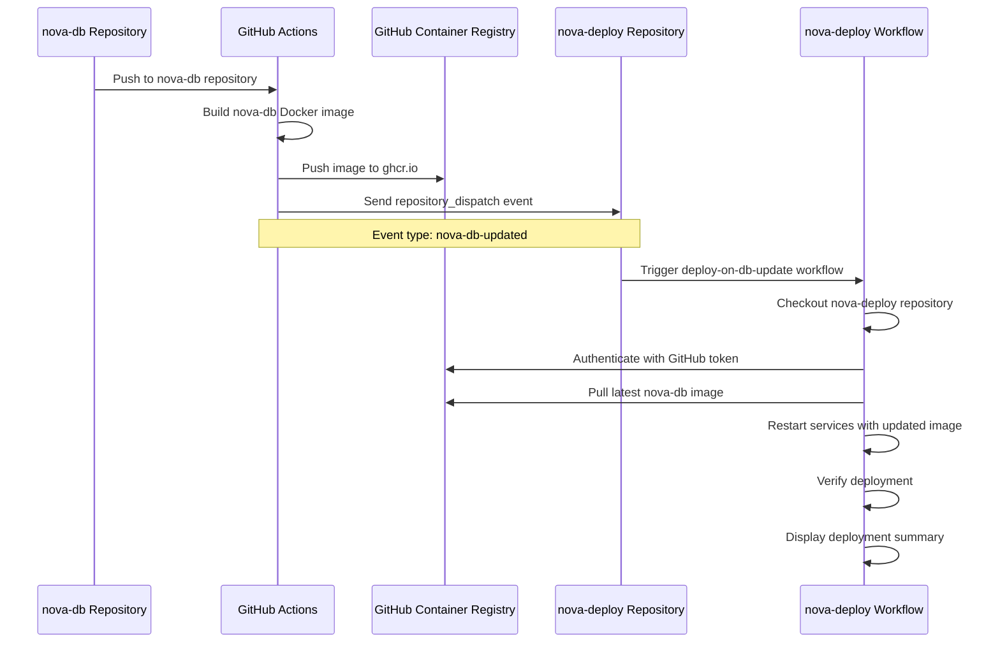

# nova-deploy

[](https://github.com/nova-eco/nova-deploy/actions/workflows/code-quality.yml)
[](https://prettier.io/)
[](https://cspell.org/)

Deployment package for the Nova database infrastructure.

## Project Status

This project is **actively maintained**. We welcome contributions, bug reports, and
feature requests.

## Table of Contents

- [Getting Started](#getting-started)
  - [Prerequisites](#prerequisites)
  - [Installation](#installation)
  - [Usage](#usage)
  - [Database Connection](#database-connection)
    - [Connecting to MariaDB from Command Line](#connecting-to-mariadb-from-command-line)
    - [Schema Updates and Data Persistence](#schema-updates-and-data-persistence)
- [Architecture](#architecture)
  - [Automated Rebuild Process](#automated-rebuild-process)
  - [Workflow Triggers](#workflow-triggers)
- [Deployment](#deployment)
  - [Digital Ocean Deployment](#digital-ocean-deployment)
  - [Required Secrets](#required-secrets)
- [Development](#development)
  - [Code Quality Standards](#code-quality-standards)
    - [Formatting](#formatting)
    - [Docker Compose Linting](#docker-compose-linting)
    - [Spell Checking](#spell-checking)
  - [Pushing Changes](#pushing-changes)
  - [Running All Checks Manually](#running-all-checks-manually)
- [Scripts](#scripts)
- [Changelog](#changelog)
- [License](#license)
- [Author](#author)

## Getting Started

### Prerequisites

- Node.js >= 21
- npm >= 10
- Docker (for running the database)
- Git

### Installation

1. **Clone the repository from GitHub:**

   ```bash
   git clone https://github.com/nova-eco/nova-deploy.git
   cd nova-deploy
   ```

2. **Install dependencies:**

   ```bash
   npm i
   ```

   This will automatically:
   - Install all required packages
   - Set up Husky git hooks for commit validation and pre-push checks
   - Copy `.env.TEMPLATE` to `.env` (if it doesn't already exist)

3. **Configure environment variables:**

   Edit the `.env` file and set the required variables. See the
   [Environment Variables](#environment-variables) section for details.

### Usage

#### Starting the Database

To start the nova-deploy database infrastructure:

```bash
npm start
```

This command will:

1. Run all code quality checks (formatting, Docker compose linting, spelling)
2. Build and start the Docker containers
3. Force recreate containers to ensure clean state

The database will be running and accessible once the command completes.

#### Stopping the Database

To stop the database and clean up resources:

```bash
npm stop
```

This command will:

1. Stop all running containers
2. Remove orphaned containers
3. Remove all images created by the deployment

#### Docker Commands

For more granular control, you can use these Docker-specific commands:

```bash
npm run docker       # Start Docker containers (without running checks)
npm run docker:start # Start containers with build and force recreate
npm run docker:stop  # Stop containers and clean up
```

**Note**: The `start` command includes quality checks before starting Docker. Use
`npm run docker` if you want to skip the checks and start containers directly.

## Environment Variables

The nova-deploy package requires several environment variables for configuration. These
are organized by package (nova-db and nova-api) with standardized prefixes for clarity.

### Database Variables (NOVA*DB*\*)

| Variable                 | Description                                | Default                       | Used In                          |
| ------------------------ | ------------------------------------------ | ----------------------------- | -------------------------------- |
| `NOVA_DB_AUTHOR`         | Author information for the nova-db package | `"Nova Admin <admin@ecodev>"` | nova-db/Dockerfile               |
| `NOVA_DB_CONTAINER_NAME` | Name of the database container             | `"nova-db"`                   | Container identification         |
| `NOVA_DB_NAME`           | MariaDB database name                      | `"nova"`                      | compose.yaml, nova-db/Dockerfile |
| `NOVA_DB_PORT`           | Database port                              | `"3306"`                      | compose.yaml port mapping        |
| `NOVA_DB_SQL_FILE`       | SQL file pattern for initialization        | `"*.sql"`                     | nova-db/Dockerfile COPY command  |
| `NOVA_DB_SQL_PATH`       | Path to SQL initialization files           | `"./sql"`                     | nova-db/Dockerfile COPY command  |
| `NOVA_DB_NETWORK`        | Docker network name                        | `"nova-network"`              | Shared network between services  |
| `NOVA_DB_USER_ROOT`      | MariaDB root username                      | `"root"`                      | Database administration          |
| `NOVA_DB_USER_ROOT_PASS` | MariaDB root password                      | `"pass"`                      | compose.yaml, nova-db/Dockerfile |
| `NOVA_DB_USER_STD`       | Standard database user for API             | `"nova_api"`                  | compose.yaml, nova-db/Dockerfile |
| `NOVA_DB_USER_STD_PASS`  | Standard user password                     | `"nova_api_pass"`             | compose.yaml, nova-db/Dockerfile |

### API Variables (NOVA*API*\*)

| Variable                  | Description                                 | Default                         | Used In                                           |
| ------------------------- | ------------------------------------------- | ------------------------------- | ------------------------------------------------- |
| `NOVA_API_AUTHOR`         | Author information for the nova-api package | `"Nova Admin <admin@nova.eco>"` | compose.yaml, nova-api/Dockerfile                 |
| `NOVA_API_CONTAINER_NAME` | Name of the API container                   | `"nova-api"`                    | Container identification                          |
| `NOVA_API_NAME`           | Logical name of the API application         | `"email_accounts"`              | compose.yaml, nova-api/Dockerfile                 |
| `NOVA_API_PORT`           | API service port                            | `"3001"`                        | compose.yaml, nova-api/Dockerfile, runtime config |
| `NOVA_API_USER_ROOT`      | Root user for API operations                | `"root"`                        | Internal API administration                       |
| `NOVA_API_USER_ROOT_PASS` | Root password for API operations            | `"pass"`                        | Internal API administration                       |
| `NOVA_API_USER_STD`       | Standard user for API operations            | `"nova_api"`                    | Internal API user management                      |
| `NOVA_API_USER_STD_PASS`  | Standard user password                      | `"nova_api_pass"`               | Internal API user management                      |

### API Application Variables (NOVA*API*\*)

| Variable                         | Description                       | Default               | Used In                                           |
| -------------------------------- | --------------------------------- | --------------------- | ------------------------------------------------- |
| `NOVA_API_SERVICE_NAME`          | Service name for the API backend  | `"nova-be-api"`       | compose.yaml, nova-api/Dockerfile, runtime config |
| `NOVA_API_DB_HOST`               | Database host for API connections | `"nova-db"`           | compose.yaml, nova-api/src/models/Database.ts     |
| `NOVA_API_DB_USER`               | Database username for API         | `"nova_api"`          | compose.yaml, nova-api/src/models/Database.ts     |
| `NOVA_API_DB_PASSWORD`           | Database password for API         | `"nova_api_pass"`     | compose.yaml, nova-api/src/models/Database.ts     |
| `NOVA_API_DB_NAME`               | Database name for API             | `"nova"`              | compose.yaml, nova-api/src/models/Database.ts     |
| `NOVA_API_EMAIL_SERVICE_ENABLED` | Enable/disable email service      | `"false"`             | nova-api/src/config/emailServiceEnabled.ts        |
| `NOVA_API_OPENAPI_DIR_NAME`      | OpenAPI specification directory   | `"public"`            | nova-api/src/config/openApiDirName.ts             |
| `NOVA_API_OPENAPI_FILE_NAME`     | OpenAPI specification filename    | `"openapi.spec.json"` | nova-api/src/config/openApiFileName.ts            |

### Variable Naming Convention

All variables follow a standardized naming convention:

- **Database variables**: `NOVA_DB_*`
- **API variables**: `NOVA_API_*`
- Single underscores (`_`) separate words
- Network configuration uses `NOVA_DB_NETWORK` as it's shared between services

### Database Connection

#### Connecting to MariaDB from Command Line

Once the database is running, you can connect using the MariaDB client:

**Method 2: Using MySQL/MariaDB Client from Host**

If you have `mysql` or `mariadb` client installed on your host machine:

```bash
# Connect via localhost
mysql -h 127.0.0.1 -P 3306 -u nova_api -p nova

# Or with mariadb command
mariadb -h 127.0.0.1 -P 3306 -u nova_api -p nova
```

#### Schema Updates and Data Persistence

The nova-db image includes SQL initialisation scripts that create tables and seed data.
These scripts **only run when the database volume is empty** (first initialisation).

**Important Behaviour:**

- **First Run**: Volume is empty → SQL scripts run → Database initialised with schema/data
- **Subsequent Runs**: Volume has data → SQL scripts are skipped → Existing data persists
- **After Image Update**: New SQL scripts in updated image are **NOT applied** to existing
  volumes

## Architecture

### Automated Rebuild Process

The following sequence diagram illustrates how nova-deploy is automatically rebuilt when
the nova-db Docker image is updated:



### Workflow Triggers

The rebuild process can be triggered in two ways:

1. **Automatic**: Via `repository_dispatch` event when nova-db is updated
2. **Manual**: Via `workflow_dispatch` through GitHub Actions UI

## Deployment

### Digital Ocean Deployment

This project includes automated deployment to Digital Ocean droplets via GitHub Actions.
The deployment workflow is triggered on every push to the `master` or `main` branch.

#### Prerequisites

1. **Digital Ocean Droplet** with:
   - Ubuntu 22.04 or later
   - Docker and Docker Compose installed
   - Node.js 21+ installed
   - SSH access configured

#### Required Secrets

Configure these secrets in your GitHub repository settings (`Settings` →
`Secrets and variables` → `Actions`):

| Secret            | Description                              | Example               |
| ----------------- | ---------------------------------------- | --------------------- |
| `DROPLET_IP`      | IP address of your Digital Ocean droplet | `203.0.113.42`        |
| `DROPLET_USER`    | SSH username (usually `root`)            | `root`                |
| `SSH_PRIVATE_KEY` | Private SSH key for authentication       | `-----BEGIN OPENSSH-` |
| `DROPLET_PORT`    | SSH port (optional, defaults to 22)      | `22`                  |
| `DEPLOY_PATH`     | Deployment directory (optional)          | `/root/nova-deploy`   |

## Development

### Code Quality Standards

This project enforces strict code quality standards using automated tools:

#### Formatting

- **Tool**: [Prettier](https://prettier.io/)
- **Configuration**: `.prettierrc.json`
- **Standards**:
  - Line width: 90 characters
  - Single quotes for strings
  - Semicolons required
  - 2-space indentation
  - LF line endings
  - Trailing commas in multi-line structures

**Commands**:

```bash
npm run format:check # Check formatting without making changes
npm run format:fix   # Automatically fix formatting issues
```

#### Docker Compose Linting

- **Tool**: Docker Compose built-in validator
- **Purpose**: Validates Docker Compose configuration files
- **What it checks**:
  - YAML syntax validity
  - Docker Compose schema compliance
  - Environment variable resolution
  - Service configuration correctness

**Commands**:

```bash
npm run lint         # Validate Docker Compose configuration
npm run lint:compose # Same as above (explicit)
```

#### Spell Checking

- **Tool**: [cspell](https://cspell.org/)
- **Configuration**: `cspell.json`
- **Standards**:
  - British English (en-gb)
  - Checks JavaScript, TypeScript, and Bash files
  - Custom dictionary for technical terms

**Commands**:

```bash
npm run spell # Check spelling
```

### Pushing Changes

This repository uses Git hooks to ensure code quality before changes are pushed. Follow
these steps:

#### 1. Make Your Changes

Edit files as needed for your feature or bugfix.

#### 2. Stage Your Changes

```bash
git add .
```

#### 3. Commit Your Changes

**IMPORTANT**: All commits must follow the
[Conventional Commits](https://www.conventionalcommits.org/) standard:

```
<type>(<scope>): <description>

[optional body]

[optional footer(s)]
```

**Commit Types**:

- `feat`: A new feature
- `fix`: A bug fix
- `docs`: Documentation changes only
- `style`: Code style changes (formatting, missing semicolons, etc.)
- `refactor`: Code changes that neither fix bugs nor add features
- `perf`: Performance improvements
- `test`: Adding or updating tests
- `build`: Changes to build system or dependencies
- `ci`: Changes to CI/CD configuration
- `chore`: Other changes that don't modify src or test files
- `revert`: Reverts a previous commit

**Examples**:

```bash
git commit -m "feat: add automated deployment trigger"
git commit -m "fix: correct environment variable name in docker compose"
git commit -m "docs: update installation instructions"
git commit -m "ci: update workflow to use latest actions"
```

**Commit Hooks**:

- The `commit-msg` hook will automatically validate your commit message format using
  Commitlint. If the format is incorrect, the commit will be rejected.
- The `prepare-commit-msg` hook will automatically generate/update the CHANGELOG.md file
  and add it to your commit. This ensures the changelog is always up to date with all
  commits.

#### 4. Push Your Changes

```bash
git push
```

**Pre-push Hook**: Before your changes are pushed, the `pre-push` hook will automatically
run:

1. **Format check** - Ensures all files are properly formatted
2. **Docker Compose lint** - Validates Docker Compose configuration
3. **Spell check** - Ensures no spelling errors

If any of these checks fail, the push will be blocked. You must fix the issues before
pushing:

```bash
npm run format:fix # Fix formatting issues
npm run check      # Run all checks manually
```

### Running All Checks Manually

To run all quality checks before committing:

```bash
npm run check
```

This runs the same checks that will be executed during the pre-push hook.

## Scripts

| Script              | Description                                      |
| ------------------- | ------------------------------------------------ |
| `npm start`         | Run checks and start Docker containers           |
| `npm stop`          | Stop Docker containers and clean up              |
| `npm run changelog` | Generate changelog from git commits              |
| `npm run check`     | Run all quality checks (format/lint/spell)       |
| `npm run docker`    | Start Docker containers (without running checks) |
| `npm run format`    | Check code formatting                            |
| `npm run lint`      | Validate Docker Compose configuration            |
| `npm run spell`     | Check spelling in source files                   |

## Changelog

All notable changes to this project are automatically documented in
[CHANGELOG.md](CHANGELOG.md). The changelog is generated from git commits using
[auto-changelog](https://github.com/CookPete/auto-changelog) and follows the
[Conventional Commits](https://www.conventionalcommits.org/) standard.

The changelog is automatically updated with each commit via the `prepare-commit-msg` git
hook.

## License

MIT

## Author

Nova Admin <admin@nova.eco>
