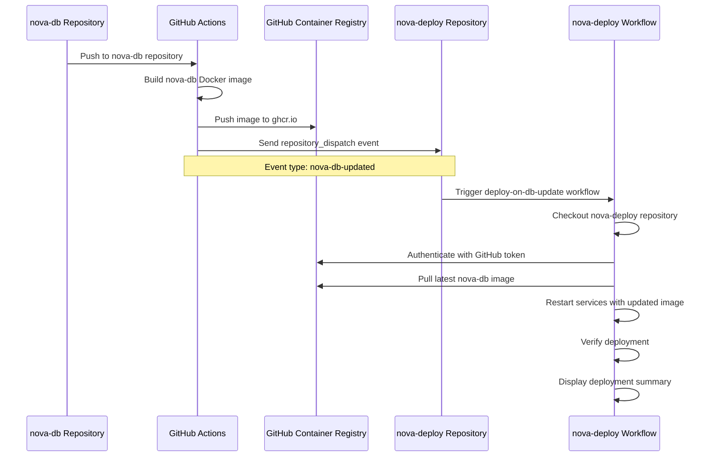

# nova-deploy

Deployment package for the Nova database infrastructure.

## Getting Started

### Prerequisites

- Node.js >= 21
- npm >= 10
- Docker (for running the database)
- Git

### Installation

1. **Clone the repository from GitHub:**

   ```bash
   git clone https://github.com/nova-eco/nova-deploy.git
   cd nova-deploy
   ```

2. **Install dependencies:**

   ```bash
   npm install
   ```

   This will automatically:

   - Install all required packages
   - Set up Husky git hooks for commit validation and pre-push checks
   - Copy `.env.TEMPLATE` to `.env` (if it doesn't already exist)

3. **Configure environment variables:**

   Edit the `.env` file and set the required variables:

   ```bash
   NOVA__NETWORK="your-network-name"
   ```

## Architecture

### Automated Rebuild Process

The following sequence diagram illustrates how nova-deploy is automatically rebuilt
when the nova-db Docker image is updated:



### Workflow Triggers

The rebuild process can be triggered in two ways:

1. **Automatic**: Via `repository_dispatch` event when nova-db is updated
2. **Manual**: Via `workflow_dispatch` through GitHub Actions UI

## Development

### Code Quality Standards

This project enforces strict code quality standards using automated tools:

#### Formatting

- **Tool**: [Prettier](https://prettier.io/)
- **Configuration**: `.prettierrc.json`
- **Standards**:
  - Line width: 90 characters
  - Single quotes for strings
  - Semicolons required
  - 2-space indentation
  - LF line endings
  - Trailing commas in multi-line structures

**Commands**:

```bash
npm run format:check  # Check formatting without making changes
npm run format:fix    # Automatically fix formatting issues
```

#### Linting

- **Tool**: [ESLint](https://eslint.org/) with TypeScript support
- **Configuration**: `eslint.config.mjs`
- **Standards**:
  - ESLint recommended rules
  - TypeScript ESLint recommended rules
  - Prettier integration (no conflicts)
  - Console statements trigger warnings
  - Prettier violations are errors

**Commands**:

```bash
npm run lint:check  # Check for linting issues
npm run lint:fix    # Automatically fix linting issues
```

#### Spell Checking

- **Tool**: [cspell](https://cspell.org/)
- **Configuration**: `cspell.json`
- **Standards**:
  - British English (en-gb)
  - Checks JavaScript, TypeScript, and Bash files
  - Custom dictionary for technical terms

**Commands**:

```bash
npm run spell  # Check spelling
```

#### Static Analysis

- **Tool**: [fta-cli](https://github.com/sgtest/fta-cli)
- **Configuration**: `fta.json`
- **Standards**:
  - Analyzes TypeScript files for code quality
  - Excludes test files and dependencies
  - Score cap: 60

**Commands**:

```bash
npm run analysis  # Run static analysis
```

### Pushing Changes

This repository uses Git hooks to ensure code quality before changes are pushed.
Follow these steps:

#### 1. Make Your Changes

Edit files as needed for your feature or bugfix.

#### 2. Stage Your Changes

```bash
git add .
```

#### 3. Commit Your Changes

**IMPORTANT**: All commits must follow the
[Conventional Commits](https://www.conventionalcommits.org/) standard:

```
<type>(<scope>): <description>

[optional body]

[optional footer(s)]
```

**Commit Types**:

- `feat`: A new feature
- `fix`: A bug fix
- `docs`: Documentation changes only
- `style`: Code style changes (formatting, missing semicolons, etc.)
- `refactor`: Code changes that neither fix bugs nor add features
- `perf`: Performance improvements
- `test`: Adding or updating tests
- `build`: Changes to build system or dependencies
- `ci`: Changes to CI/CD configuration
- `chore`: Other changes that don't modify src or test files
- `revert`: Reverts a previous commit

**Examples**:

```bash
git commit -m "feat: add automated deployment trigger"
git commit -m "fix: correct environment variable name in docker compose"
git commit -m "docs: update installation instructions"
git commit -m "ci: update workflow to use latest actions"
```

**Commit Hook**: The `commit-msg` hook will automatically validate your commit
message format using Commitlint. If the format is incorrect, the commit will be
rejected with an error message.

#### 4. Push Your Changes

```bash
git push
```

**Pre-push Hook**: Before your changes are pushed, the `pre-push` hook will
automatically run:

1. **Format check** - Ensures all files are properly formatted
2. **Lint check** - Ensures code meets linting standards
3. **Spell check** - Ensures no spelling errors
4. **Static analysis** - Ensures code quality metrics are met

If any of these checks fail, the push will be blocked. You must fix the issues before
pushing:

```bash
npm run format:fix  # Fix formatting issues
npm run lint:fix    # Fix linting issues
npm run check       # Run all checks manually
```

### Running All Checks Manually

To run all quality checks before committing:

```bash
npm run check
```

This runs the same checks that will be executed during the pre-push hook.

## Scripts

| Script              | Description                                |
| ------------------- | ------------------------------------------ |
| `npm run analysis`  | Run static code analysis                   |
| `npm run changelog` | Generate changelog from git commits        |
| `npm run check`     | Run all quality checks (format/lint/spell) |
| `npm run format`    | Check code formatting                      |
| `npm run lint`      | Check code for linting issues              |
| `npm run spell`     | Check spelling in source files             |

## License

MIT

## Author

Nova Admin <admin@nova.eco>
